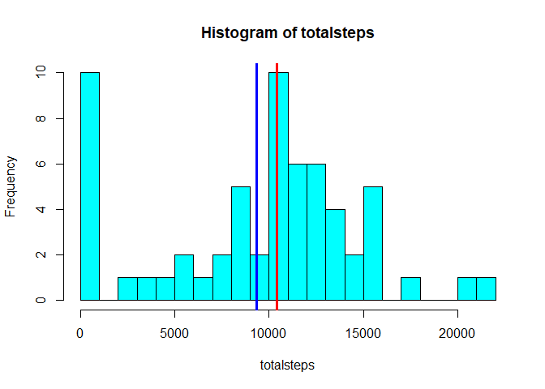
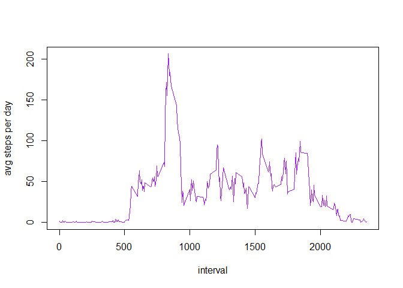
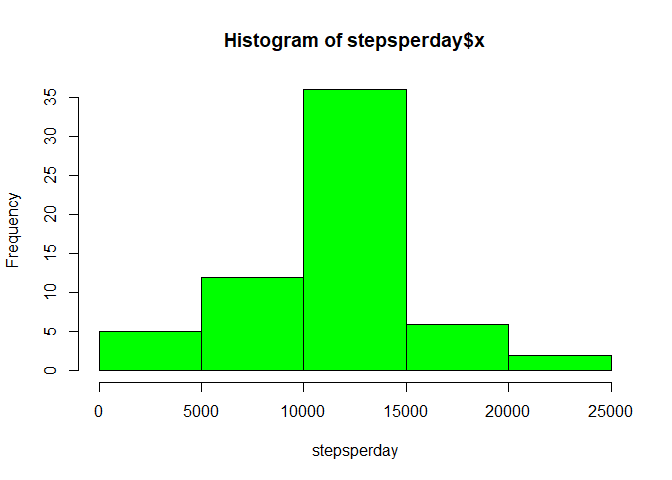
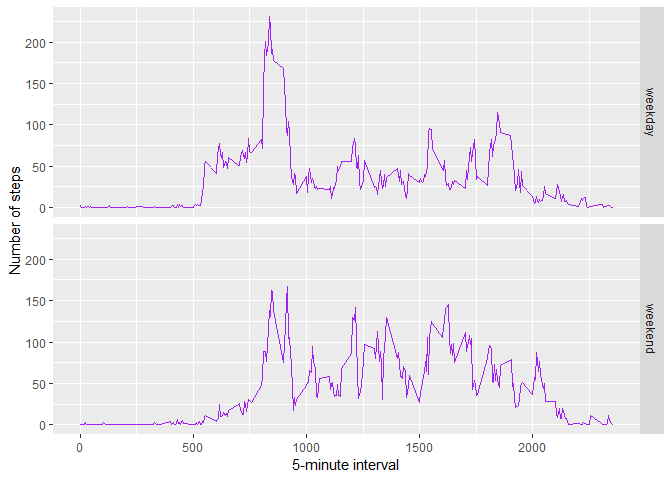

# Reproducible Research: Peer Assessment 1

## Loading and preprocessing the data

```r
unzip(zipfile="activity.zip")
activity <- read.csv("activity.csv")
```

## What is mean total number of steps taken per day?

```r
totalsteps<-tapply(activity$steps,activity$date,sum,na.rm=TRUE)
hist(totalsteps,col="cyan" ,breaks=30)
abline(v=c(mean(totalsteps),median(totalsteps)),lwd=3,col=c("blue","red"))
legend(17000,25,col=c("blue","red"),c("mean","median"),pch=c("l","l"))
```

<!-- -->

```r
mean(totalsteps)
```

```
## [1] 9354.23
```

```r
median(totalsteps)
```

```
## [1] 10395
```

## What is the average daily activity pattern?

```r
meansteps<-tapply(activity$steps,INDEX =  activity$interval,mean,na.rm=TRUE)
plot(unique(activity$interval),meansteps,type="l",col="purple",xlab="interval",ylab="avg steps per day")
```

<!-- -->

```r
#interval that containts maximum steps
unique(activity$interval)[which.max(meansteps)]
```

```
## [1] 835
```

## Imputing missing values


```r
sum(is.na(activity$steps))
```

```
## [1] 2304
```

All of the missing values are filled in with mean value for that 5-minute
interval.


```r
# Replace each missing value with the mean value of its 5-minute interval
sum(is.na(activity$steps))
```

```
## [1] 2304
```

```r
nonaactivity<-activity
mean_per_interval<-aggregate(nonaactivity$steps,by =list(nonaactivity$interval),FUN=mean,na.rm=TRUE)
names(mean_per_interval)<-c("interval","mean")
for(i in 1:17568){
if(is.na(nonaactivity$steps[i])){
       nonaactivity$steps[i]<-mean_per_interval$mean[mean_per_interval$interval==nonaactivity$interval[i]]
        
}
}
any(is.na(nonaactivity$steps))
```

```
## [1] FALSE
```
Now, using the filled data set, let's make a histogram of the total number of steps taken each day and calculate the mean and median total number of steps.


```r
stepsperday<-aggregate(nonaactivity$steps,by=list(nonaactivity$date),FUN=sum)
hist(stepsperday$x,xlab="stepsperday",col="green")
```

<!-- -->

```r
mean(stepsperday$x)
```

```
## [1] 10766.19
```

```r
median(stepsperday$x)
```

```
## [1] 10766.19
```

Mean and median values are higher after imputing missing data. The reason is
that in the original data, there are some days with `steps` values `NA` for 
any `interval`. The total number of steps taken in such days are set to 0s by
default. However, after replacing missing `steps` values with the mean `steps`
of associated `interval` value, these 0 values are removed from the histogram
of total number of steps taken each day.

## Are there differences in activity patterns between weekdays and weekends?
First, let's find the day of the week for each measurement in the dataset. In
this part, we use the dataset with the filled-in values.


```r
day<-weekdays(as.Date(nonaactivity$date))
nonaactivity$day<-"weekday"
nonaactivity$day[day=="Saturday"|day=="Sunday"]<-"weekend"
```

Now, let's make a panel plot containing plots of average number of steps taken
on weekdays and weekends.

```r
library(ggplot2)
averages <- aggregate(steps ~ interval + day, data=nonaactivity, mean)
ggplot(averages, aes(interval, steps)) + geom_line(col="purple") + facet_grid(day ~ .) +
    xlab("5-minute interval") + ylab("Number of steps")
```

<!-- -->
